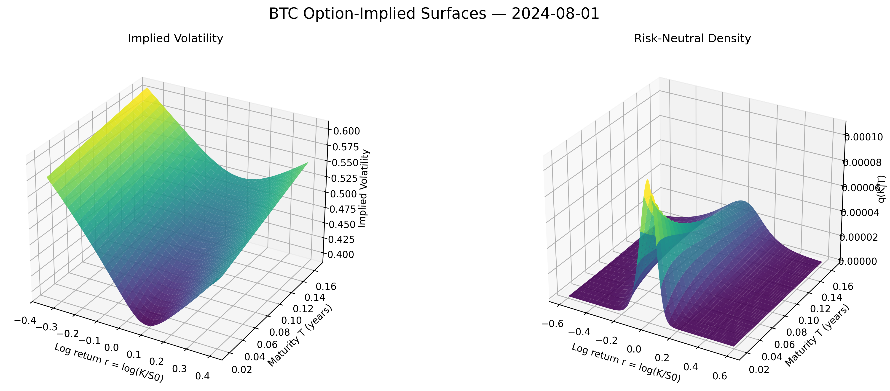
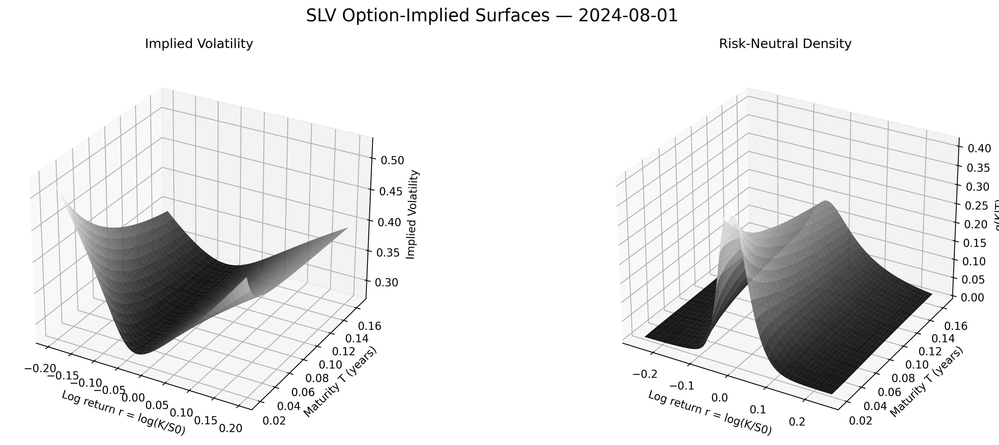
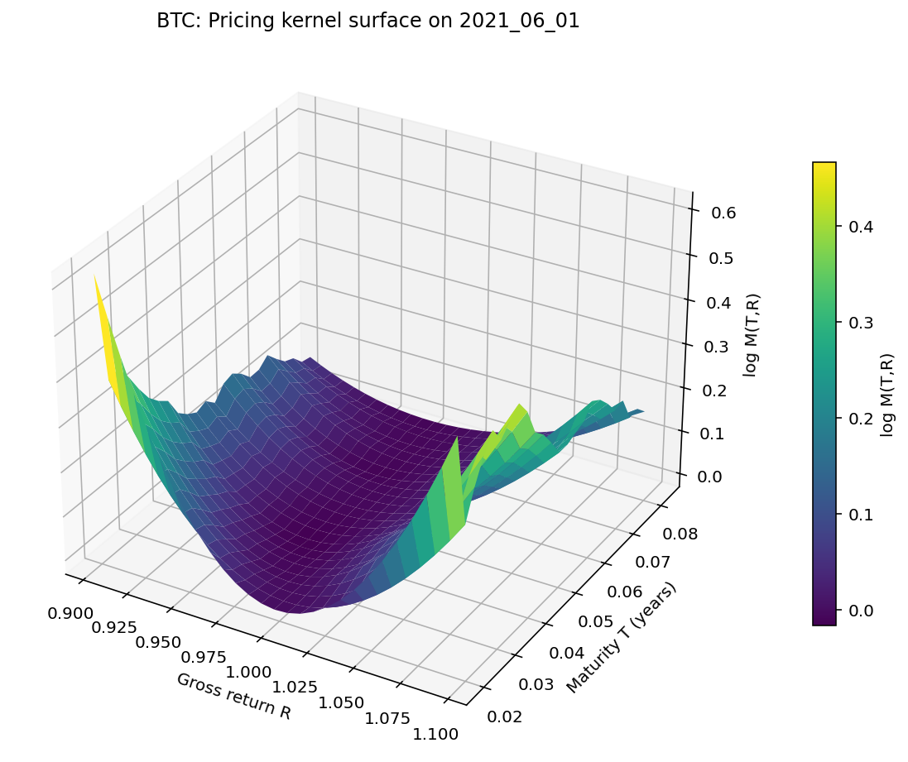
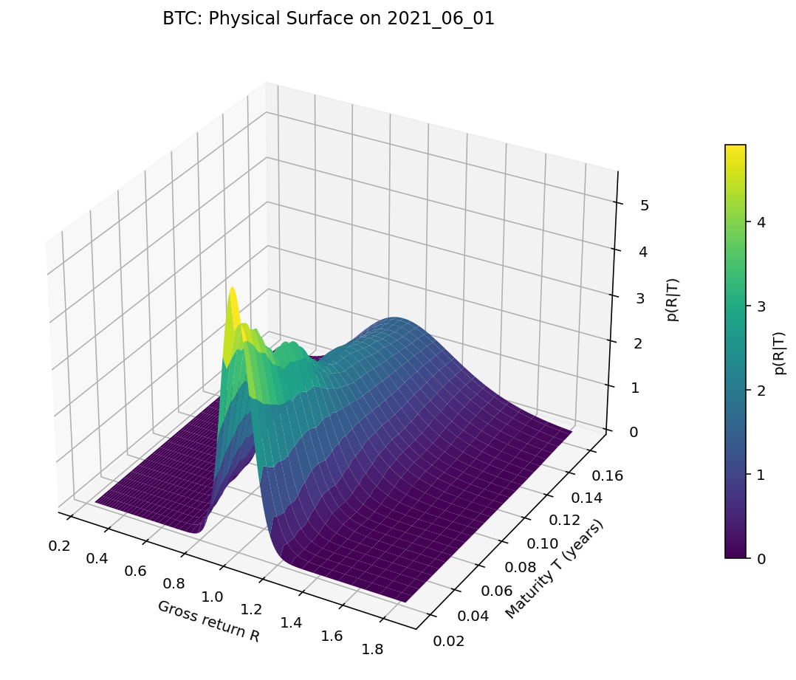
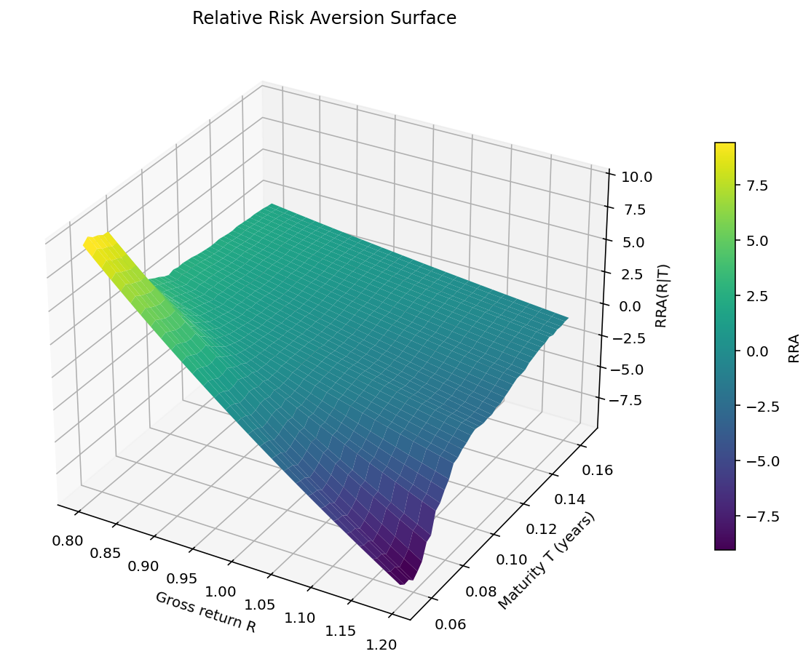
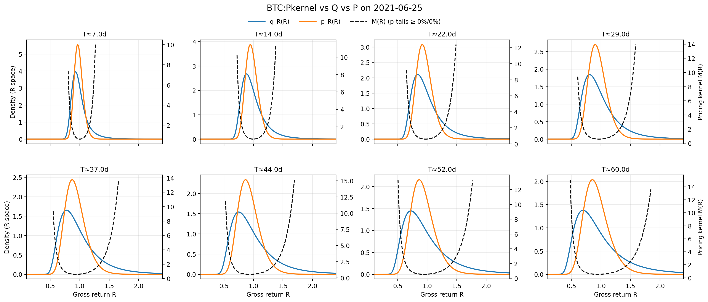
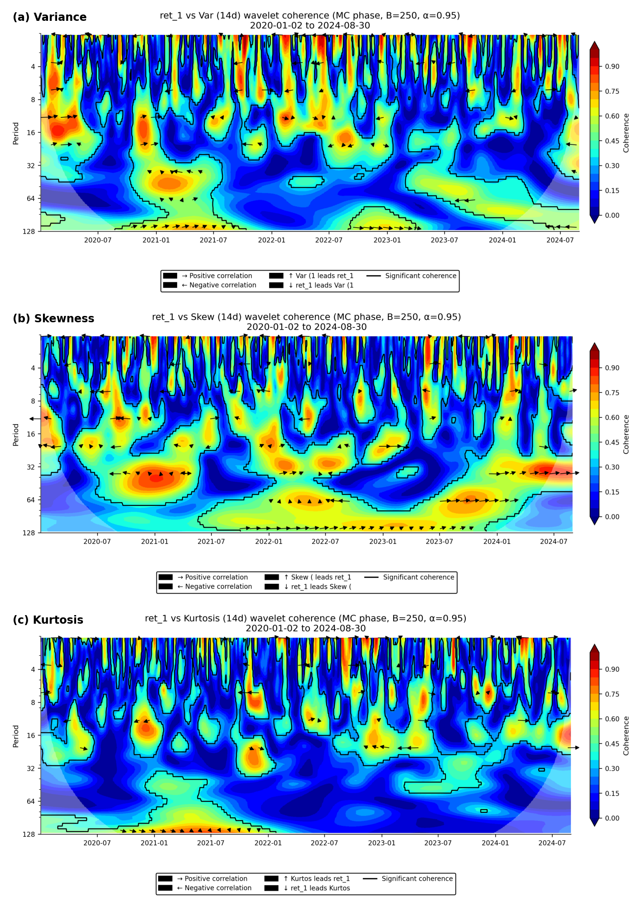
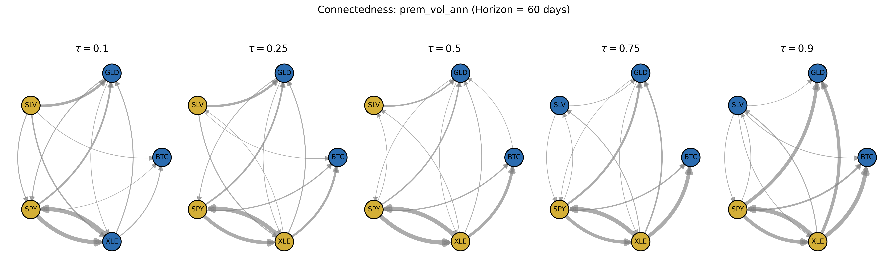
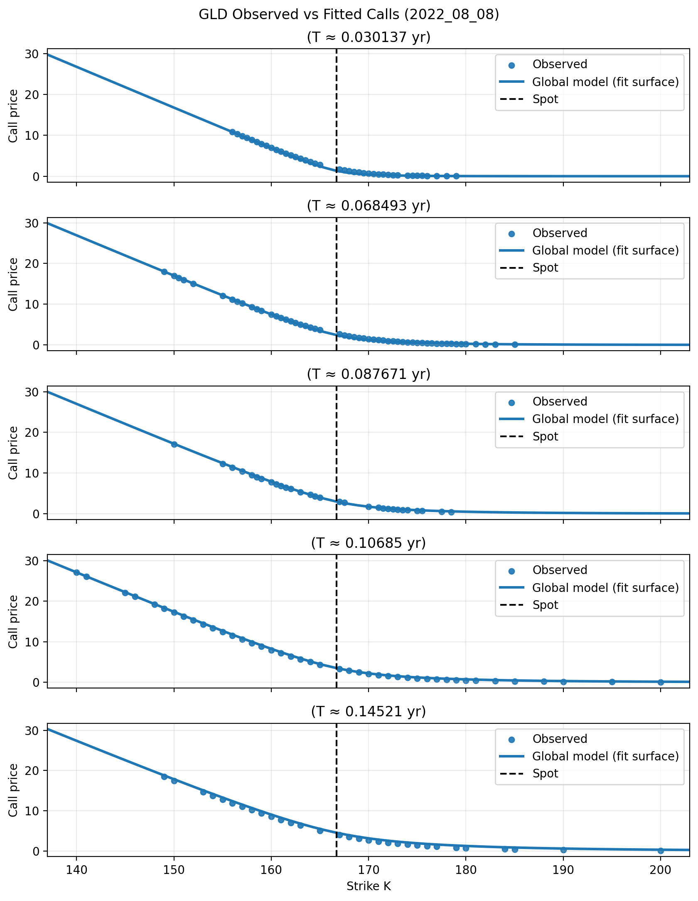
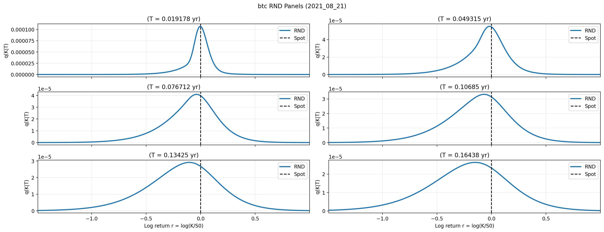

# PyDerivatives 5.0  
### A Modern Toolkit for Option Pricing, Densities, and Econometric Analysis

**PyDerivatives** is an easy-to-use Python toolbox for **option pricing** and **financial econometrics**, with a particular emphasis on implementing **state-of-the-art methodologies from the academic literature** and making them readily accessible to researchers, practitioners, and data scientists.

The package is designed to provide a unified and extensible framework for estimating, analyzing, and visualizing option-implied objects across multiple asset classes.

---

## Core Capabilities

PyDerivatives supports full estimation and calibration of:

- **Call price surfaces**
- **Implied volatility (IV) surfaces**
- **Risk-neutral density (RND) surfaces**
- **Pricing kernel surfaces**
- **Physical density (PD) surfaces**

These objects can be constructed using a broad class of advanced option pricing models and nonparametric techniques, with a strong focus on robustness, flexibility, and empirical relevance.

---

## Installation

PyDerivatives can be installed directly from PyPI:

```bash
pip install pyderivatives
from pyderivatives import*
```






## Pricing Kernel and Physical Density Estimation


PyDerivatives includes tools for estimating **physical densities** and **pricing kernels**, allowing researchers to study risk preferences, risk premia, and state dependence:

- **Conditional pricing kernel estimation via exponential polynomials**  
  Schreindorfer, D., & Sichert, T. (2025).  
  *Conditional risk and the pricing kernel*.  
  *Journal of Financial Economics*, 171, 104106.






---

## Arbitrage Detection and Removal

The package provides functionality for enforcing static no-arbitrage conditions on option price surfaces:

- **Static arbitrage detection and repair**  
  Cohen, S. N., Reisinger, C., & Wang, S. (2020).  
  *Detecting and repairing arbitrage in traded option prices*.  
  *Applied Mathematical Finance*, 27(5), 345–373.

---

## Econometric Toolbox

### Wavelet Analysis

- Crowley, P. M. (2007).  
  *A guide to wavelets for economists*.  
  *Journal of Economic Surveys*, 21(2), 207–267.
  


  ### Quantile Time-Varying VAR (QTVP-VAR)

- Raza, S. A., Ahmed, M., & Ali, S. (2026).  
  *Untangling market links: A QVAR–TVP VAR analysis of precious metals and oil amid the pandemic*.  
  *Journal of Futures Markets*, 46(1), 101–120.


### Quantile Regression Analysis

- Badshah, I., et al. (2016).  
  *Asymmetries of the intraday return–volatility relation*.  
  *International Review of Financial Analysis*, 48, 182–192.


## Call Surface, Implied Volatility Surface, and Risk-Neutral Density Estimation
- **Two-factor stochastic volatility with double-exponential jumps (Double Heston–Kou)**  
  Guohe, D. (2020). *Option pricing under two-factor stochastic volatility jump-diffusion model*.  
  *Complexity*, Hindawi.

- **Two-factor stochastic volatility model (Double Heston)**  
  Christoffersen, P., Heston, S., & Jacobs, K. (2009).  
  *The shape and term structure of the index option smirk: Why multifactor stochastic volatility models work so well*.  
  *Management Science*, 55(12), 1914–1932.

- **Stochastic volatility with double-exponential jumps (Heston–Kou)**  
  Ahlip, R., & Rutkowski, M. (2015).  
  *Semi-analytical pricing of currency options in the Heston/CIR jump-diffusion hybrid model*.  
  *Applied Mathematical Finance*, 22(1), 1–27.

- **Jump-diffusion with double-exponential jumps (Kou model)**  
  Kou, S. G. (2002). *A jump-diffusion model for option pricing*.  
  *Management Science*, 48(8), 1086–1101.

- **Stochastic volatility with lognormal jumps (Bates model)**  
  Bates, D. S. (1996). *Jumps and stochastic volatility: Exchange rate processes implicit in Deutsche Mark options*.  
  *Review of Financial Studies*, 9(1), 69–107.

- **Stochastic volatility model (Heston)**  
  Heston, S. L. (1993). *A closed-form solution for options with stochastic volatility, with applications to bond and currency options*.  
  *Review of Financial Studies*, 6(2), 327–343.

- **Black–Scholes model**



---


