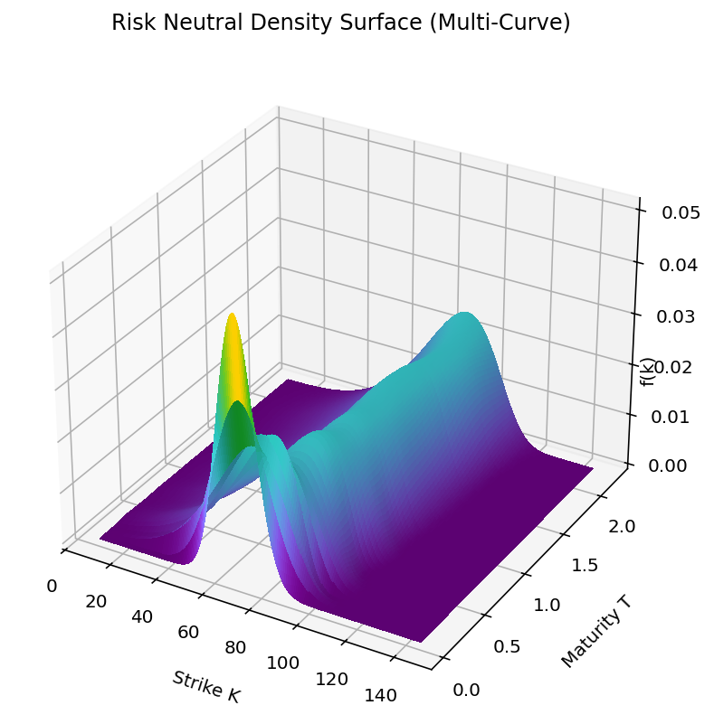

# **Option Toolbox for Python**

## **Overview**
This repository provides an easy-to-use toolbox for option pricing, with a strong emphasis on implementing state-of-the-art models from leading journals in finance, econometrics, and applied mathematics.  
Each module is designed to make advanced academic methods *practical, modular, and directly usable* for research and production. Notable features include risk neutral density surface estimation, and IV/Call surface estimation.

## **Risk Neutral Density Surface Estimation**

---
## **Full Call Surface Estimation**

---
## **Implemented Option Pricers**

### **1. Parametric Risk-Neutral Density Estimation**  
**Source:** *Journal of Econometrics, Yifan Li (2024)*  
- **(a)** Mixture of lognormal and Weibull distributions  
- **(b)** Evolutionary-algorithm–based model selection  

---

### **2. Nonparametric Option Pricing Under Shape Restrictions**  
**Source:** *Journal of Econometrics, Aït-Sahalia (2003)*  
- **(a)** Locally linear kernel regression of the call price function  
- **(b)** Expanded bandwidth selection: Scott’s rule and cross-validation using a 2-lognormal mixture (new)  
- **(c)** Kernel density estimator–based post-processing for RND extraction  

---

### **3. Quartic Polynomial Implied Volatility Fitting**  
**Source:** *Federal Reserve Conference, Figlewski (2010)*  
- **(a)** Polynomial fitting of the IV curve with a knot at-the-money  
- **(b)** GEV-based extrapolation (coming soon)

---

### **4. Option-Implied Risk Aversion Estimation**  
**Source:** *Journal of Finance, Bliss & Panigirtzoglou (2004)*  
- **(a)** Cubic spline fitting of the implied volatility curve  

---

### **5. Positive Convolution Approximation for RND Estimation**  
**Source:** *Journal of Econometrics, Bondarenko (2003)*  
- **(a)** Positive convolutions of Gaussian kernels to fit the call price function  

---

### **6. Sieve Estimation of the Option-Implied State Price Density**  
**Source:** *Journal of Econometrics, Lu & Qu (2021)*  
- **(a)** Hermite-basis sieve estimator applied to call prices  

---

### **7. Approximate Option Valuation Using Hermite Expansions**  
**Source:** *Journal of Financial Economics, Jarrow & Rudd (1982)*  
- **(a)** Fourth-order Hermite series approximation to option prices  

---

### **8. Risk-Neutral Density Recovery via Spectral Analysis**  
**Source:** *SIAM Journal on Financial Mathematics, Monnier (2013)*  
- **(a)** Inverse-problem spectral method for computing the RND  

---

### **9. Spline and Hypergeometric Methods for RND Estimation**  
**Source:** *Econometrics Journal, Ruijun Bu (2007)*  
- **(a)** Hypergeometric-function–based fitting of option prices  

---

# Sample Plots

## Evolutionary Mixtures vs Natural Cubic Splines
Evolutionary Mixtures are compared to natural cubic splines

